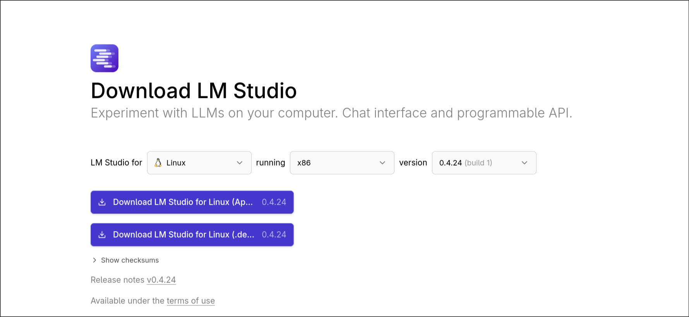
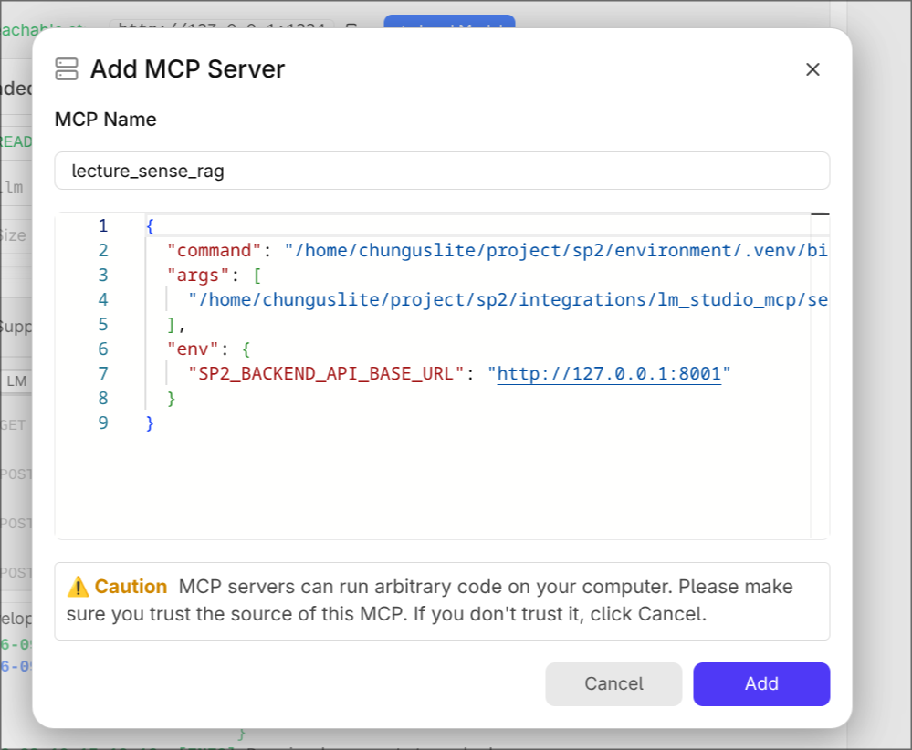
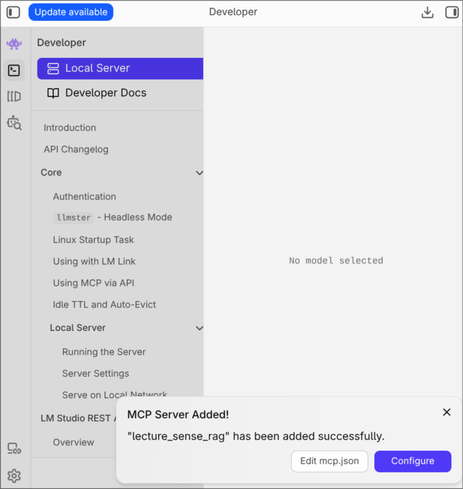
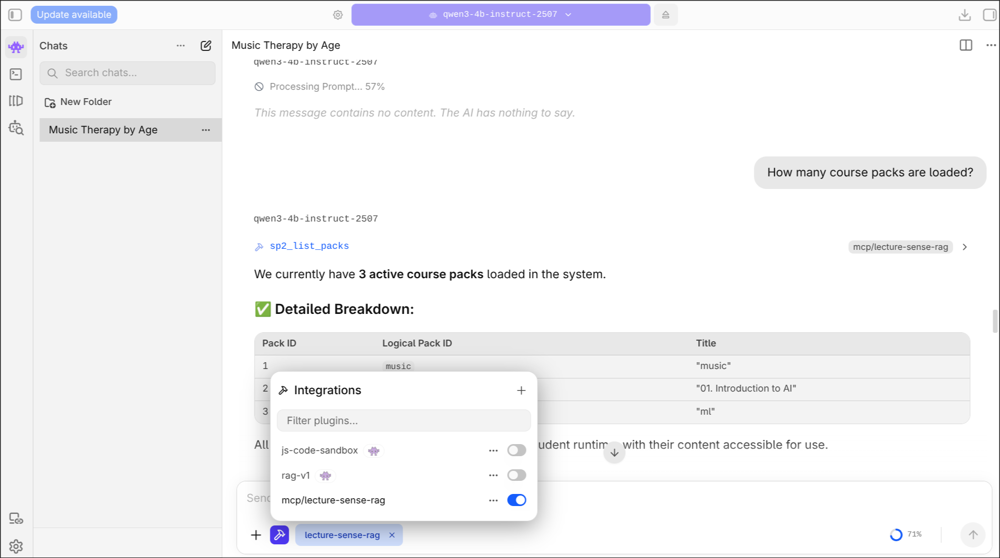
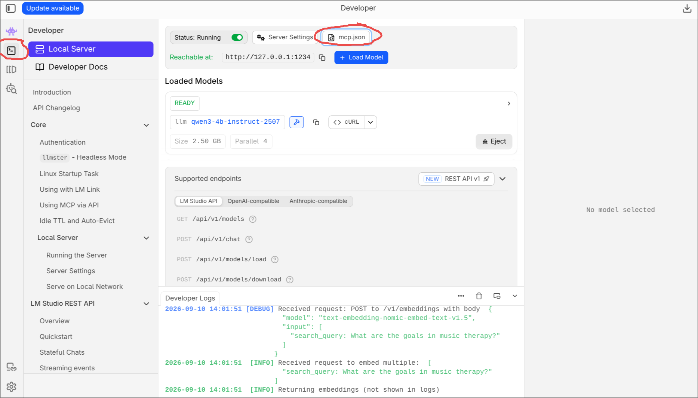
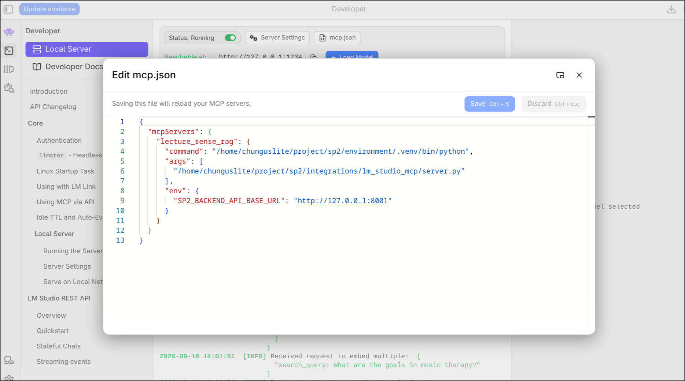

# SP2

SP2 turns local course files into searchable packs for LM Studio. SP2 stores and
searches the course material; LM Studio provides the chat and final answer.

## Before You Start: Hardware

**SP2 needs a mid-range machine or better.** It keeps LM Studio, a 4B chat
model, and an embedding model in memory at the same time, and that combination
is genuinely demanding.

| | RAM | What to expect |
|---|---|---|
| **Recommended** | 16 GB or more | Runs comfortably |
| **Workable** | 8-16 GB | Fine, but close browsers and IDEs while using SP2 |
| **Not recommended** | under 8 GB | Slow, and the operating system may kill LM Studio mid-use |

That last row is not theoretical. On a 7.5 GB development machine, the Linux
out-of-memory killer terminated LM Studio four separate times during testing,
once taking the whole desktop session down with it. The installer prints an
advisory warning if it detects under 8 GB, but it will not stop you.

**Disk: about 6 GB free, or 12 GB if you accept LM Studio's starter model.**
SP2's own models are modest - a 2.5 GB chat model and an 84 MB embedding model.

On first launch, LM Studio offers a suggested starter model of its own. **SP2
does not need it, and you can skip it.** Accepting it cost 5.9 GB of disk on the
development machine, downloading in the background while SP2's own setup was
running - which on a low-RAM machine is a good way to run into trouble. To
decline it:

- On the **Your first model** screen, click **Skip for now**, underneath the
  Download button.
- Do not click **Continue** and assume that declines it - the download keeps
  going in the background.
- If it has already started, open **Downloads** (the downward-arrow icon) and
  cancel that model with the **x** beside it.

## Prerequisites

- Python 3.10 or newer
- pip
- LM Studio installed and opened at least once (see below)
- LM Studio local server authentication turned off
- Internet access and about 6 GB of free disk space
- 8 GB RAM minimum, 16 GB recommended (see the table above)
- A local copy of this repository

No models or document tools need to be installed manually. The setup script
handles them.

## Install LM Studio

SP2 runs on top of LM Studio, so install it first. Download it from
**https://lmstudio.ai/download**.

The page detects your platform, but check the dropdowns before downloading -
they select the operating system, the processor architecture, and the version.



| Platform | What you get |
|---|---|
| Windows | An `.exe` installer - run it and follow the prompts |
| macOS | A `.dmg` - open it and drag LM Studio to Applications. Pick the Apple Silicon or Intel build to match your Mac |
| Linux | Either an `.AppImage` or a `.deb`. The `.deb` installs like any package; for the AppImage, make it executable with `chmod +x` and run it directly |

**Then open LM Studio once before running SP2's setup script.** This is not
optional. LM Studio creates its command-line tool (`lms`) on first launch, and
SP2's installer needs it to download and load models. Running setup before that
first launch fails with "LM Studio's 'lms' command was not found". If you hit
that, open LM Studio, then restart your terminal before trying again - a shell
opened earlier will not see the new command.

First launch also offers you a starter model. Skip it - SP2 downloads the models
it needs itself, and letting that 5.9 GB download run in the background while SP2
setup is working competes for bandwidth and memory. See the disk note at the top
of this file for how to decline or cancel it.

## Install SP2

Linux or macOS:

```bash
git clone https://github.com/DanilaDerii/sp2.git
cd sp2
```

```bash
cd /path/to/sp2
python3 installation/script.py
```

Windows PowerShell:

```powershell
git clone https://github.com/DanilaDerii/sp2.git
Set-Location .\sp2
```

```powershell
Set-Location -LiteralPath 'C:\path\to\sp2'
py .\installation\script.py
```

The script:

- creates the Python environment and installs dependencies;
- creates SQLite and LanceDB;
- downloads and loads the Nomic embedding model;
- downloads and loads the Qwen chat model;
- starts the LM Studio server and SP2 backend;
- opens LM Studio's MCP approval prompt;
- prints the backend command for future starts.

## Approve the LM Studio Tool

At the end of setup, LM Studio opens an **Add MCP Server** dialog for
`lecture_sense_rag`. Check that the paths point at your copy of the repository,
then confirm.



The caution about MCP servers running code is LM Studio's standard warning for
any MCP server. In this case the code being run is SP2's own `server.py`, from
the repository you cloned.

If you have installed SP2 before, the dialog also warns that a server of that
name already exists and the button reads **Override lecture_sense_rag** rather
than Add. That is expected - it replaces the old entry with current paths.

A confirmation appears once it is added:



LM Studio displays the tool in chat as:

```text
mcp/lecture-sense-rag
```

**Then turn it on in your chat - approving it once is not the same thing.**
Every new chat has its own tool toggles, and a chat with the tool switched off
will answer from the model's own knowledge without ever touching your course
material.

Open a chat, click the hammer icon to open **Integrations**, and switch
`mcp/lecture-sense-rag` on:



The example above shows what a working setup looks like: the toggle is on, and
the answer came back through an `sp2_list_packs` call rather than from the
model's own knowledge.

If the approval prompt never opened, use the installation link printed by the
setup script, or check `mcp.json` directly - see
[Troubleshooting: Finding mcp.json](#troubleshooting-finding-mcpjson).

## Start the Backend Later

The installer starts the backend automatically. After restarting your device,
open LM Studio, start its local server, load the Qwen and Nomic models, and then
start the SP2 backend.

Linux or macOS:

```bash
cd /path/to/sp2
environment/.venv/bin/python -m uvicorn backend.api.api:app --host 127.0.0.1 --port 8001
```

Windows PowerShell:

```powershell
Set-Location -LiteralPath 'C:\path\to\sp2'
& '.\environment\.venv\Scripts\python.exe' -m uvicorn backend.api.api:app --host 127.0.0.1 --port 8001
```

Leave that terminal open. Press `Ctrl+C` to stop the backend.

## Supported Course Files

SP2 supports `.pdf`, `.odt`, `.docx`, and `.pptx`. Legacy `.ppt` files must be
saved as `.pptx` first.

You can provide one exact file or a directory. A directory is searched
recursively and its supported files are combined into one pack.

Use absolute paths. Windows paths are supported.

## MCP Tool Reference

SP2 registers eight tools. All of them appear in LM Studio under
`mcp/lecture-sense-rag`.

| Tool | What it does | Arguments |
|---|---|---|
| `sp2_ingest_file_from_path` | Build a pack from a file or folder, and install it | `file_path` |
| `sp2_import_pack_from_path` | Install a pack ZIP built elsewhere | `pack_zip_path` |
| `sp2_list_packs` | List installed packs | `pack_id`, `active_only` (both optional) |
| `sp2_get_pack` | Show details for one pack | `installed_pack_id` |
| `sp2_get_course_context` | Search a pack and return the most relevant chunks | `pack`, `question` |
| `sp2_get_file_summary_context` | Return **every** chunk from one file, to summarize | `pack`, `source_id` |
| `sp2_get_pack_summary_context` | Return **every** chunk from a pack, to summarize | `pack` |
| `sp2_delete_pack` | Remove an installed pack | `pack` |

**Naming a pack.** Anywhere a tool takes `pack`, you can use either the number
from `sp2_list_packs` or the pack's name, so `1`, `"1"`, and `"music"` all
work. The one exception is `sp2_delete_pack`, which requires the number on
purpose: a deletion should never be ambiguous about which pack it removes.

## Talking to SP2

Ask questions about your course material in plain language and SP2 will find the
relevant parts and answer from them - just mention that you mean your course
material, so it searches your pack instead of answering from general knowledge.
Answers pulled from a pack cite page numbers.

For actions - building a pack, importing one, deleting one - you can name the
tool and arguments directly. Each example below shows the plain-language version
first, with the exact tool call underneath.

### Build a pack from your course files

> Build a course pack from /home/me/lectures/psych101

<details><summary>Explicit form</summary>

```text
Use mcp/lecture-sense-rag.
Call sp2_ingest_file_from_path with:
file_path: /absolute/path/to/course-file-or-directory
```
</details>

This builds a portable ZIP, installs it, and returns the pack's number. The ZIP
is saved to `<sp2-repository>/artifacts/<pack-id>.zip`, and the response
includes the exact `zip_path`. Copy that ZIP to another device to share the
pack.

### Install a pack somebody sent you

> Import the course pack at /home/me/Downloads/psych101.zip

<details><summary>Explicit form</summary>

```text
Use mcp/lecture-sense-rag.
Call sp2_import_pack_from_path with:
pack_zip_path: /absolute/path/to/course-pack.zip
```
</details>

### See what is installed

> Which course packs do I have?

<details><summary>Explicit form</summary>

```text
Use mcp/lecture-sense-rag.
Call sp2_list_packs with:
pack_id: null
active_only: false
```
</details>

For detail on a single pack:

> Show me the details of pack 1

### Ask a question about a course

> What does my course material say about the prerequisites for this course?

<details><summary>Explicit form</summary>

```text
Use mcp/lecture-sense-rag.
Call sp2_get_course_context with:
pack: 1
question: What are the prerequisites for this course?

After the tool returns, answer using the returned course chunks.
If the chunks do not contain the answer, say so.
```
</details>

This searches the pack and returns the most relevant passages with their page
numbers, so answers can cite where they came from.

### Summarize a whole file or pack

> Summarize lecture.pdf from my psych101 pack

<details><summary>Explicit form</summary>

```text
Use mcp/lecture-sense-rag.
Call sp2_get_file_summary_context with:
pack: 1
source_id: lecture.pdf

Then summarize all returned chunks.
```

For the complete pack, use `sp2_get_pack_summary_context` with just `pack`.
</details>

Unlike asking a question, these return **every** stored chunk in order rather
than searching for relevant ones. `source_id` is the file's name as stored in
the pack, for example `lecture.pdf`. Large packs can fill a big share of the
model's context window.

### Delete a pack

> Delete pack 1

<details><summary>Explicit form</summary>

```text
Use mcp/lecture-sense-rag.
Call sp2_delete_pack with:
pack: 1
```
</details>

This removes the installed files, database row, and vectors. ZIP files in
`artifacts/` are kept.

## Clear Local Storage

Linux or macOS:

```bash
cd /path/to/sp2
environment/.venv/bin/python -m cli.cli_clearOut --yes
```

Windows PowerShell:

```powershell
Set-Location -LiteralPath 'C:\path\to\sp2'
& '.\environment\.venv\Scripts\python.exe' -m cli.cli_clearOut --yes
```

This removes installed packs and recreates SQLite and LanceDB. ZIP files in
`artifacts/` are kept.

## Troubleshooting: Finding `mcp.json`

SP2 writes its entry into LM Studio's `mcp.json`. If the approval prompt never
appeared, or the tool stopped working after you moved the repository, this is
the file to check.

**Step 1 - open the Developer tab, then Local Server.** The Developer tab is
the terminal icon in the far-left sidebar. The `mcp.json` button sits along the
top of that panel, next to Server Settings.



**Step 2 - check the entry.** The editor opens with the current config. Saving
reloads the MCP servers, so you can fix a wrong path here without restarting
LM Studio.



Both paths must point at **your** copy of the repository:

```json
{
  "mcpServers": {
    "lecture_sense_rag": {
      "command": "/path/to/sp2/environment/.venv/bin/python",
      "args": ["/path/to/sp2/integrations/lm_studio_mcp/server.py"],
      "env": { "SP2_BACKEND_API_BASE_URL": "http://127.0.0.1:8001" }
    }
  }
}
```

On Windows, `command` ends with `environment\.venv\Scripts\python.exe` instead.

If you would rather edit the file directly, it lives at `~/.lmstudio/mcp.json`
on Linux and macOS, and `%USERPROFILE%\.lmstudio\mcp.json` on Windows.
